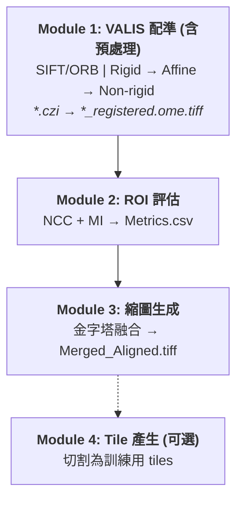

# VALIS Pipeline (舊版)

## 流程圖

## 模組詳細說明

### Module 1: VALIS 配準 (含預處理)

- **核心技術**: SIFT/ORB 特徵提取，配準流程為 `Rigid` $\rightarrow$ `Affine` $\rightarrow$ `Non-rigid`。
- **輸入/輸出**: `*.czi` $\rightarrow$ `*_registered.ome.tiff`。

### Module 2: ROI 評估

- **核心技術**: 使用 NCC (Normalized Cross-Correlation) 與 MI (Mutual Information) 進行評估。
- **輸出**: `Metrics.csv`。

### Module 3: 縮圖生成

- **核心技術**: 金字塔融合 (Pyramid Blending)。
- **輸出**: `Merged_Aligned.tiff`。

### Module 4: Tile 產生 (可選)

- **目的**: 將影像切割為可用於模型訓練的 tiles。
