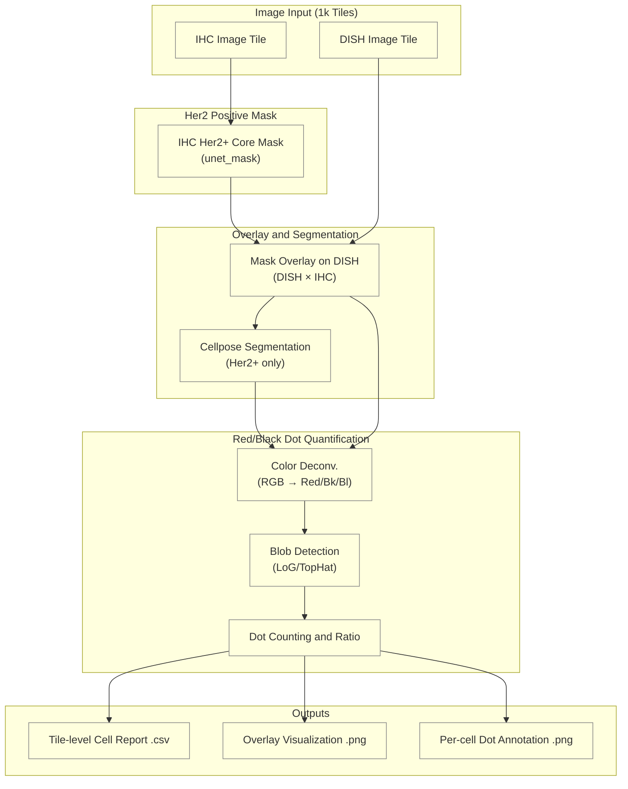

# Software Design Document (SDD): IHC-DISH Overlay & Analysis Pipeline

## 1. Goals and Scope

This document defines an **implementation-ready specification** for the IHC-DISH single-cell analysis workflow, using 1k tiles as the minimum processing unit:

1. Overlay IHC Her2+ core masks onto DISH images.
2. Run Cellpose instance segmentation on the masked DISH images.
3. Quantify black/red dots and compute ratios per segmented cell.
4. Export traceable CSV outputs and visualizations.

Out of scope for this phase:

- Re-running cross-modality registration (VALIS alignment is assumed complete and tile coordinates are one-to-one).
- UI / interactive annotation tools.
- End-to-end whole-slide (WSI) re-tiling.

---

## 2. Pipeline Overview



---

## 3. Input/Output Contract (Data Contract)

### 3.1 Input Contract

- `ihc_tile`: shape `(H, W, 3)`, `uint8`, RGB.
- `dish_tile`: shape `(H, W, 3)`, `uint8`, RGB.
- `ihc_core_mask`: shape `(H, W)`, `bool` or `{0,1}`.
- Default `H=W=1024`. Non-1024 tiles are allowed, but `ihc_core_mask` and `dish_tile` must have identical spatial dimensions.
- Tile names must contain parseable coordinates: `tile_x{int}_y{int}`.

### 3.2 Intermediate Data Contract

- `masked_dish_tile`: shape `(H, W, 3)`, `uint8`; non-ROI pixels are filled with `0`.
- `cell_instance_mask`: shape `(H, W)`, `int32`; background is `0`, cell IDs are `1..N`.

### 3.3 Output Contract

- `tile_report.csv` (one row per cell):
  - `slide_id, tile_id, cell_id, centroid_x, centroid_y, black_dot_count, red_dot_count, ratio, is_border_cell, model_version, config_hash`。
- `overlay_vis.png`: includes cell boundaries and red/black dot annotations.
- `cells/cell_{cell_id}.png`: cropped per-cell annotation image.

### 3.4 Ratio Rules

- `ratio = black_dot_count / red_dot_count`.
- When `red_dot_count == 0`:
    - If `black_dot_count > 0`, `ratio = inf`.
    - If `black_dot_count == 0`, `ratio = nan`.

---

## 4. Module Interfaces (Implementation Baseline)

```python
from dataclasses import dataclass
from pathlib import Path
from typing import List
import numpy as np


@dataclass
class CellAnalysisResult:
    cell_id: int
    centroid_x: float
    centroid_y: float
    is_her2_positive: bool
    black_dot_count: int
    red_dot_count: int
    ratio: float


def overlay_ihc_mask_on_dish(
    dish_image: np.ndarray,
    ihc_core_mask: np.ndarray,
) -> np.ndarray:
    """Apply IHC Her2+ mask to DISH tile and return masked DISH image."""


def segment_masked_dish(masked_dish_image: np.ndarray) -> np.ndarray:
    """Run Cellpose inference on masked DISH and return instance mask."""


def quantify_dish_signals(
    masked_dish_image: np.ndarray,
    cell_instance_mask: np.ndarray,
) -> List[CellAnalysisResult]:
    """Compute black/red dot counts and ratio for each cell."""


def export_cell_dot_annotations(
    masked_dish_image: np.ndarray,
    cell_instance_mask: np.ndarray,
    results: List[CellAnalysisResult],
    output_dir: Path,
) -> None:
    """Export per-cell annotation images."""
```

---

## 5. Error Handling and Edge Cases

- Dimension mismatch (mask vs image) → raise `ValueError` and log `tile_id`.
- Missing paired tiles (IHC/DISH) → log warning and skip that tile.
- All-zero `ihc_core_mask` → export empty CSV (header only), do not run Cellpose.
- Cellpose inference failure → log error, mark tile as failed, continue batch.
- Border-touching cells → remove by default via `clear_border` and report removed count.

---

## 6. Parameter Management and Override Priority

Configuration source priority (high → low):

1. CLI args
2. Environment variables
3. `config.py`
4. Defaults in `config_example.py`

Required tunable parameters:

- Overlay: `mask_blur_sigma`, `background_fill_value`
- Cellpose: `model_path`, `diameter`, `flow_threshold`, `cellprob_threshold`
- Dot detection: `od_matrix`, `log_sigma`, `min_blob_area`, `cluster_area_factor`
- Runtime: `num_workers`, `batch_size`, `device`

---

## 7. Acceptance Criteria (Definition of Done)

### 7.1 Functional Acceptance

- Every input tile produces a corresponding output (success or traceable failure reason).
- Output CSV includes all required fields, and `cell_id` is unique within each tile.
- Overlay and per-cell annotation images map back to CSV records.

### 7.2 Quality Acceptance (Initial Thresholds; Tunable by Dataset)

- Segmentation (against reference labels): `mean Dice >= 0.75`.
- Dot counting (against pathologist labels): `MAE <= 1.0 dot / cell`.
- Ratio stability: repeated runs on same batch `CV <= 10%` (sampled cells).

### 7.3 Performance Acceptance (Per 1k Tile)

- End-to-end average processing time: `<= 2.0 s/tile` (GPU inference scenario).
- Peak memory per process: `<= 2 GB`.

---

## 8. Test Plan

| Test Level | Test Content | Expected Result |
| :--- | :--- | :--- |
| Unit | `overlay_ihc_mask_on_dish` shape/type validation | Raises `ValueError` on shape mismatch |
| Unit | `ratio` edge cases (`red=0`) | Correctly outputs `inf` or `nan` |
| Unit | Cluster area estimation | Follows `cluster_area_factor` rule |
| Integration | Single-tile E2E (fixed fixture) | Produces CSV/PNG with correct fields and file names |
| Regression | Golden dataset (small batch) | Core metrics do not regress below baseline |
| Performance | 100-tile stress test | Average runtime and peak memory meet thresholds |

---

## 9. Risks and Mitigations (Condensed)

| Risk | Mitigation | Monitoring Metric |
| :--- | :--- | :--- |
| Black-background edge artifacts | Mild smoothing via `mask_blur_sigma` | Border false-positive cell rate |
| Tile-edge truncation | Remove border cells using `clear_border` | Removed border-cell ratio |
| Dot-cluster undercount | Area-based cluster compensation | Manual-sample MAE |
| Batch stain variation | Configurable OD matrix | Metric drift across batches |
| Batch OOM | Chunked processing + immediate memory release | Peak memory usage |

---

## 10. Behavior Scenarios (BDD)

The following scenarios are the baseline for requirement alignment and acceptance testing, using Given / When / Then.

### Scenario 1: Overlay keeps only Her2+ ROI

**Given** a correctly paired `dish_tile` and `ihc_core_mask` with matching dimensions  
**When** `overlay_ihc_mask_on_dish` is executed  
**Then** non-ROI pixels are set to `background_fill_value` (default `0`), and ROI pixels retain original DISH values.

### Scenario 2: Overlay stops processing tile on shape mismatch

**Given** `dish_tile.shape[:2] != ihc_core_mask.shape[:2]`  
**When** the overlay module is executed  
**Then** a `ValueError` is raised, `tile_id` and error reason are logged, and the tile does not proceed to segmentation.

### Scenario 3: Empty Her2 mask does not call Cellpose

**Given** `ihc_core_mask` is all zeros  
**When** tile pipeline execution starts  
**Then** an empty result (header-only CSV) is exported and `skipped_reason=empty_core_mask` is recorded.

### Scenario 4: Segmentation output must be valid instance labels

**Given** a valid `masked_dish_tile`  
**When** `segment_masked_dish` is executed  
**Then** output `cell_instance_mask` has background `0`, positive integer cell IDs (continuous or non-continuous), and each pixel belongs to exactly one ID.

### Scenario 5: Border-cell rule is consistently applied

**Given** `cell_instance_mask` contains cells touching tile borders  
**When** `clear_border` strategy is enabled  
**Then** border cells are removed and output statistics include `removed_border_cell_count`.

### Scenario 6: `red=0` ratio rule is deterministic

**Given** single-cell dot counting result with `red_dot_count == 0`  
**When** ratio is computed  
**Then** ratio is `inf` if `black_dot_count > 0`; ratio is `nan` if `black_dot_count == 0`.

### Scenario 7: Cluster compensation behavior is predictable

**Given** a connected component area larger than `cluster_area_factor * avg_single_dot_area`  
**When** dot quantification is executed  
**Then** the component is converted to multiple dots by area ratio, and the conversion is traceable in outputs.

### Scenario 8: Traceability fields are mandatory

**Given** any tile finishes processing (success or failure)  
**When** reports and run summaries are written  
**Then** outputs include `run_id`, `model_version`, `config_hash`, `tile_id`, `status`, and `error_reason` (for failures).

---

## 11. Implementation Checklist (Execution Order)

| Milestone | Deliverable | Acceptance |
| :--- | :--- | :--- |
| M1 Overlay | Implement mask overlay and paired tile loading | Unit tests pass and masked tile is exported |
| M2 Segmentation | Integrate Cellpose inference and instance mask output | Produces `1..N` labels and passes integration test |
| M3 Dot Quant | Implement deconvolution + blob detection + ratio | Outputs per-cell black/red counts and ratio |
| M4 Export | Implement CSV and visualization exports | File naming, schema, and traceability fields are complete |
| M5 Regression | Run golden-set regression and performance report | Meets DoD thresholds |

---

## 12. Traceability Requirements

Each run must record:

- `run_id`, `timestamp`, `git_commit` (if available)
- `model_version`, `config_hash`, `device`
- Number of successful/failed tiles and failure-reason distribution

These records support pathology validation, version comparison, and auditability.
