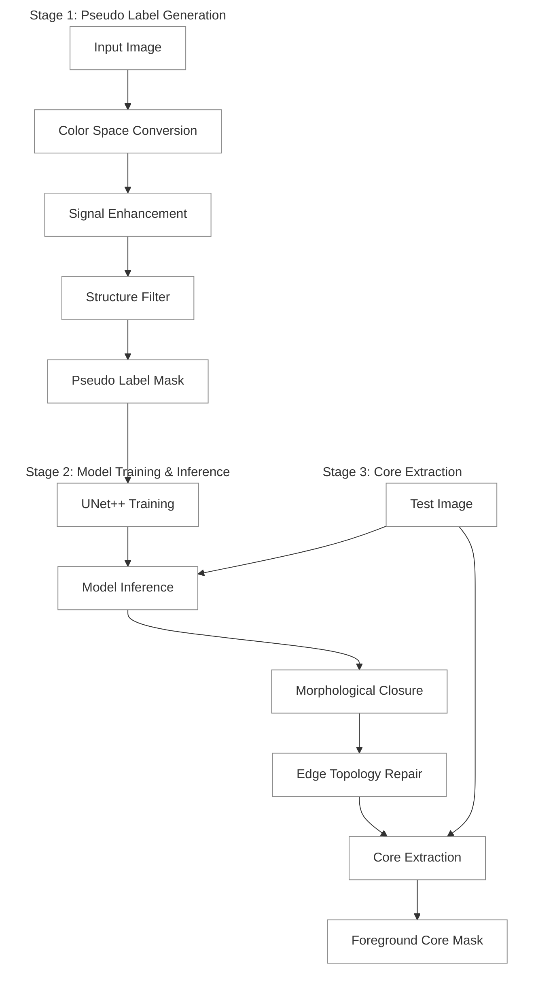

# System Architecture

This document outlines the system architecture for the HER2 positive cell membrane and core extraction pipeline, comprising `lab_mask_generator.py` and `core_extractor.py`.

## Overall Pipeline

The processing pipeline is divided into three primary stages:

1. **Stage 1: Pseudo Label Generation**
   Extracts cell membrane masks automatically using physical color space transformations and structure-enhancing filters without manual annotation.
2. **Stage 2: Deep Learning Training**
   Trains a UNet++ model to learn and generalize membrane features from the generated pseudo labels.
3. **Stage 3: Topological Core Extraction**
   Applies structured mathematical topology operations on predicted membrane masks to extract the internal cell core.

---

## Architecture Diagram

---

## Component Details

### 1. lab_mask_generator.py (Stage 1)

- **Function:** Applies color space transformations (LAB, HED) and Gamma correction to standardize signal variance.
- **Enhancement:** Utilizes Frangi filtering to isolate tubular/linear membrane structures accurately without expanding global noise.

### 2. inference.py & train_unetpp.py (Stage 2)

- **Function:** Trains UNet++ to robustly segment membranes.
- **Process:** Reads model configurations and hyperparameters explicitly through configuration modules.

### 3. core_extractor.py (Stage 3)

- **Function:** Solves topological discrepancies such as discontinuous inference boundaries and edge-truncated cells.
- **Process:** Implements morphological closing and edge padding logic to ensure watertight boundaries before performing hole-filling operations.

---

## Engineering Standards

1. **Path Independence:**
   Directory structures and file resolutions strictly utilize the `pathlib.Path` library. String concatenations (`+`, `f-strings`) for file mapping are strictly prohibited.

2. **Configuration Separation:**
   All environment-specific paths and algorithm constants are decoupled from core logic. Default templates reside in `config_example.py` and are loaded dynamically via `config.py`.

3. **Type Hinting & Documentation:**
   Functions denote explicit type constraints (`np.ndarray`, `Path`, etc.) for inputs and return types. Component logic is documented utilizing Google Style docstrings.

4. **Execution Protocol:**
   Traceability is managed through built-in logging modules. Unstructured `print()` statements are forbidden, particularly within iterative processing mechanisms (e.g., batched image processing).
