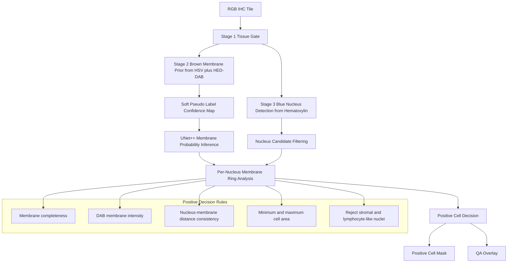

# High-Precision HER2 Positive Cell Pipeline Blueprint

## Purpose

This document defines a safe implementation plan for upgrading the current `unet_mask` pipeline into a **high-precision HER2-positive single-cell extraction pipeline**.

This project is **not** a general HER2 0/1+/2+/3+ scoring system.
The dataset consists of **HER2 3+ IHC images only**.

Because the downstream analysis is cell-level, the most important requirement is:

**Minimize false-positive cells, even at the cost of lower recall.**


## Project Paths

The coding agent must use the following paths unless the user explicitly changes them.

- Training image input: `/home/sec312/project/tsgh/cell_mask/unet_mask/tile/train/her2_chose`
- Soft mask output: `/home/sec312/project/tsgh/cell_mask/unet_mask/output/mask`
- Model output directory: `/home/sec312/project/tsgh/cell_mask/unet_mask/output/model`


## Core Decision

The proposed idea is reliable **only if implemented as a high-precision, multi-constraint cell extraction pipeline**, not as another weak pseudo-label shortcut.

The pipeline must not decide that a cell is positive merely because:

- a blue nucleus exists nearby,
- a brown region exists nearby,
- or a membrane-like mask overlaps a cell candidate.

Instead, a cell is HER2-positive only when the following are jointly satisfied:

- a valid hematoxylin nucleus is present,
- a surrounding membrane ring is detected,
- the membrane ring is sufficiently complete,
- the membrane signal is sufficiently strong in DAB,
- the local geometry is consistent with a single cell,
- obvious stromal cells and lymphocytes are rejected.


## Why This Should Be More Reliable Than the Current Pipeline

The current pipeline is limited by two structural issues:

- pseudo masks are generated from handcrafted color heuristics and then treated as if they were trustworthy labels,
- training converts those masks into hard binary targets too early.

That design amplifies labeling noise.

The upgraded design is more reliable because it changes the problem definition:

- from pixel-only membrane segmentation,
- to **cell-level positive-cell validation** with biological constraints.

This is a better match for the real task: extracting trustworthy HER2-positive single cells.


## Design Principles

- Optimize for **precision first**, not recall.
- Keep membrane prediction as a **continuous probability/confidence map** as long as possible.
- Use HSV and DAB as a **prior**, not as the final truth.
- Use nuclei only as **cell anchors**, not as standalone positive evidence.
- Reject uncertain cells instead of forcing a label.
- Preserve intermediate outputs for quality control and debugging.
- Do not perform a large refactor unless required by this blueprint.


## Non-Goals

- Do not build a slide-level HER2 classifier.
- Do not attempt a full pathology-grade tumor/stroma semantic segmentation in the first pass.
- Do not assume weak membrane staining should be preserved.
- Do not maximize the number of exported cells.
- Do not convert every candidate into a final cell instance.


## Pipeline Overview




## High-Level Architecture

### Stage 1. Tissue Gate

Purpose:
Remove white background and obvious non-tissue regions before any color analysis.

Requirements:

- Keep the current tissue gating logic if it already works well.
- Output a binary tissue mask for all later stages.
- Ensure the tissue mask is conservative and does not remove edge cells.


### Stage 2. Brown Membrane Prior from HSV plus HED-DAB

Purpose:
Create a **soft membrane confidence prior** that highlights brown membranous structures while suppressing weak diffuse brown background and non-membrane staining.

Requirements:

- Use HSV to detect candidate brown pixels.
- Use HED color deconvolution to obtain the DAB channel.
- Combine HSV and DAB into a **continuous confidence map** in `[0, 1]`.
- Penalize diffuse low-contrast brown regions.
- Keep strong, thin, membrane-like structures.
- Avoid global min-max amplification that turns background noise into strong signal.

Important constraint:

- This output is a **prior**, not a final mask.


### Stage 3. Blue Nucleus Detection from Hematoxylin

Purpose:
Use nuclei as anchors for single-cell reasoning.

Requirements:

- Detect nuclei primarily from the hematoxylin channel.
- Produce nucleus instances or, at minimum, connected nucleus candidates.
- Reject very small, very round, densely packed nuclei likely to be lymphocytes.
- Reject elongated stromal-like nuclei when possible using morphology.
- Keep nucleus centroid, area, eccentricity, and bounding box for downstream rules.

Important constraint:

- A nucleus is necessary but not sufficient for HER2 positivity.


### Stage 4. UNet++ Membrane Probability

Purpose:
Generate a learned membrane probability map that improves over handcrafted color priors.

Requirements:

- Keep `predict_proba` and make it the default source for downstream decision logic.
- Do not reduce the UNet++ output to a hard binary membrane mask too early.
- Store or expose the membrane probability map for cell-level decision making.

Important constraint:

- The final positive-cell decision must use membrane probability and membrane geometry together.


### Stage 5. Per-Nucleus Membrane Ring Analysis

Purpose:
Determine whether each nucleus is surrounded by a biologically plausible HER2-positive membrane ring.

For each nucleus candidate, compute at least:

- membrane ring completeness,
- mean membrane probability on the ring,
- mean DAB intensity on the ring,
- fraction of the ring supported by HSV plus DAB prior,
- nucleus-to-ring radial consistency,
- estimated cell area after filling the membrane region.

Recommended strategy:

- Build a radial or morphological ring around each nucleus.
- Intersect that ring with membrane probability and DAB evidence.
- Compute circumferential support instead of simple overlap.


### Stage 6. Positive Cell Decision

Purpose:
Promote only high-confidence single cells to the final HER2-positive set.

A cell should be positive only if all mandatory rules pass:

- nucleus candidate passes morphology filter,
- membrane completeness is above threshold,
- membrane DAB intensity is above threshold,
- membrane probability is above threshold,
- estimated cell area is within a valid range,
- the candidate is not classified as likely stromal or lymphocyte-like.

Recommended behavior:

- Uncertain candidates should be rejected, not down-ranked into the final set.


## Implementation Strategy

The implementation must be done in **three phases**.


## Phase 1. Build a High-Precision Inference-Only Extractor First

This phase provides the fastest reliability gain and should be implemented before retraining.

Goal:
Use the current UNet++ model output together with nucleus detection and strict cell-level rules.

Why first:

- it directly attacks the false-positive problem,
- it does not depend on new annotations,
- it avoids retraining on noisy labels before the decision logic is fixed.

Phase 1 deliverables:

- a new cell-level positive extractor,
- QA overlays.


## Phase 2. Replace Binary Pseudo Masks with Soft Confidence Maps

Goal:
Change pseudo-label generation from a hard red mask to a confidence map derived from HSV plus DAB.

These soft confidence maps are the recommended training targets for the next UNet++ training cycle.

Requirements:

- save soft confidence as grayscale or single-channel float-compatible image format,
- optionally save a thresholded visualization separately,
- avoid throwing away uncertainty during mask generation.

Key rule:

- the pseudo-label generator must produce **confidence**, not pretend ground truth.


## Phase 3. Retrain UNet++ with Soft Supervision

Goal:
Use the improved soft membrane prior to train a better membrane model.

Requirements:

- keep the current two-class output if needed for compatibility,
- but train using soft targets or confidence-aware loss,
- keep membrane probability as the primary downstream signal.

Acceptable options:

- binary cross-entropy with soft labels,
- Dice plus BCE using soft targets,
- confidence weighting that down-weights uncertain pseudo-label pixels.


## Recommended Model Choice

For the current codebase, the recommended model is still **UNet++**.

Why:

- it already exists in the project,
- it matches the current training and inference pipeline,
- it is easier and safer to improve one stable segmentation backbone than to replace the whole stack,
- the main reliability bottleneck is currently the target generation and cell-level decision logic, not the backbone alone.

Recommendation:

- use the upgraded pipeline to generate better soft membrane targets,
- retrain UNet++ on those targets,
- use the retrained UNet++ probability map inside the positive-cell extractor.

Alternative models such as Cellpose, Mask R-CNN, SOLOv2, or StarDist may be considered later, but they should not be the first implementation step.

Reason:

- they increase engineering complexity,
- they require more instance-aware supervision or more careful adaptation,
- they do not solve the current weak-label problem by themselves.

Therefore, the safest path is:

1. improve the weak targets,
2. improve the cell-level decision rules,
3. retrain UNet++,
4. only then evaluate whether a different instance model is necessary.


## File-Level Change Plan

The coding agent should use the following file plan.

| File | Action | Purpose |
| --- | --- | --- |
| `cell_mask/unet_mask/config.py` | Update | Add thresholds and output settings for nucleus filtering, membrane completeness, and debug visualization. |
| `cell_mask/unet_mask/config_example.py` | Update | Mirror every new config parameter. |
| `cell_mask/unet_mask/inference.py` | Update | Preserve and expose membrane probability cleanly for downstream logic. |
| `cell_mask/unet_mask/lab_mask_generator.py` | Update | Replace hard pseudo-mask logic with HSV plus DAB soft confidence map generation. |
| `cell_mask/unet_mask/core_extractor.py` | Update or partially reuse | Keep only the useful membrane-fill logic; do not let this module define positivity alone. |
| `cell_mask/unet_mask/train_unetpp.py` | Update | Stop hard-binarizing pseudo masks too early and support soft supervision. |
| `cell_mask/unet_mask/her2_positive_extractor.py` | Add | New high-precision cell-level extraction module. |
| `cell_mask/unet_mask/docs/` | Update | Keep this blueprint and add any additional implementation notes if required. |


## Required New Config Parameters

At minimum, add parameters for:

- `hsv_membrane_lower`
- `hsv_membrane_upper`
- `use_hsv_dab_fusion`
- `membrane_prior_min_confidence`
- `membrane_prior_save_soft_map`
- `nucleus_min_area`
- `nucleus_max_area`
- `nucleus_max_eccentricity`
- `lymphocyte_max_area`
- `stroma_min_eccentricity`
- `positive_ring_inner_radius`
- `positive_ring_outer_radius`
- `positive_membrane_prob_threshold`
- `positive_dab_intensity_threshold`
- `positive_ring_completeness_threshold`
- `positive_cell_min_area`
- `positive_cell_max_area`
- `positive_reject_uncertain`
- `positive_save_debug_overlay`

All new config fields must be added to both `config.py` and `config_example.py`.


## Detailed Coding Contract for the Agent

The coding agent must follow these rules exactly.

### Must Do

- Keep all new logic modular and small.
- Use `pathlib.Path` for all paths.
- Use `logging`, not `print`.
- Add type hints to every new function.
- Add Google-style docstrings.
- Keep probability maps as float-like values as long as possible.
- Save enough debug outputs to inspect false positives.
- Preserve current working behavior where not explicitly changed.

### Must Not Do

- Do not rewrite the whole project structure.
- Do not remove `predict_proba`.
- Do not hard-binarize membrane probability before cell-level scoring.
- Do not define a positive cell by plain pixel overlap.
- Do not assume every blue nucleus is a tumor cell.
- Do not silently change existing path conventions.
- Do not add hidden thresholds without config exposure.

### If Uncertain

- Prefer rejecting a cell instead of accepting it.
- Prefer writing an intermediate debug artifact instead of hiding the ambiguity.


## Minimum API Contract for the New Extractor

The new extractor module should expose a function similar to:

```python
def extract_her2_positive_cells(
    image: np.ndarray,
    membrane_probability: np.ndarray,
    config: Config,
) -> dict:
    """Return positive cell masks, scores, and QA overlays."""
```

The returned structure should include:

- accepted cells,
- rejected cells,
- summary counts,
- cell masks,
- debug overlays.


## Decision Logic Specification

For each nucleus candidate:

1. Build a candidate membrane ring around the nucleus.
2. Measure how much of the ring is supported by membrane probability.
3. Measure how much of the same ring is supported by DAB evidence.
4. Estimate whether the ring forms a sufficiently complete circumference.
5. Fill the membrane-supported region to estimate a single-cell interior.
6. Reject the candidate if the filled area is implausibly small or large.
7. Reject the candidate if morphology suggests lymphocyte or stromal cell.
8. Accept only if all required thresholds pass.

This means the final cell mask is derived from:

- nucleus anchor,
- membrane probability,
- DAB support,
- geometry constraints.

It must **not** be derived from membrane pixels alone.


## Recommended Intermediate Outputs

The upgraded pipeline should save the following debug outputs per tile:

- tissue mask,
- soft HSV plus DAB membrane prior,
- hematoxylin nucleus mask,
- nucleus candidates before filtering,
- accepted nucleus anchors,
- membrane probability map,
- ring completeness heatmap,
- accepted cell overlay,
- rejected cell overlay with rejection reasons.


## Validation Criteria

The implementation is acceptable only if the following are true during visual review.

- Stromal and lymphocyte false positives are visibly reduced.
- Exported positive cells almost always contain a valid nucleus.
- Exported positive cells are supported by a membrane ring, not only by diffuse brown area.
- The number of obviously merged multi-cell masks is reduced.
Preferred evaluation target:

- Higher precision than the current pipeline, even if fewer cells are exported.


## Practical Recommendation

The first coding pass should implement **Phase 1 only**.

That means:

- keep the current trained UNet++ model,
- add nucleus detection,
- add membrane ring completeness scoring,
- add strict positive-cell decision rules,
- add positive cell masks and QA overlays.

This is the safest way to obtain a meaningful reliability gain without retraining on noisy labels first.


## Final Instruction to the Coding Agent

Implement this blueprint incrementally.

Start with **Phase 1** and do not proceed to retraining changes unless Phase 1 outputs are visually validated.

If a design choice conflicts with this document, prefer:

- higher precision over higher recall,
- explicit configuration over hidden constants,
- debug visibility over silent automation,
- cell-level biological plausibility over pixel-level coverage.